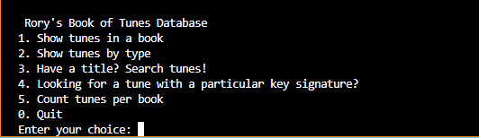
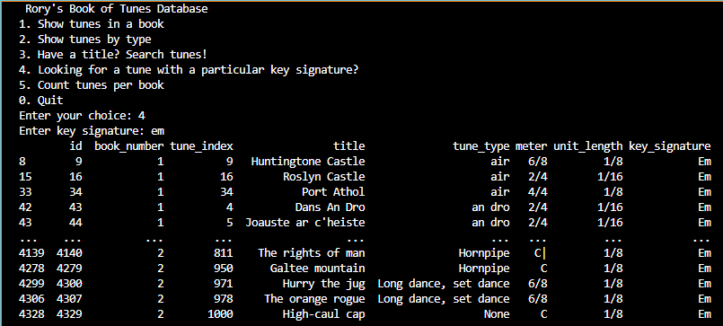

# Data Centric Programming Assignment 2025

- [Assignment Brief](assignment.md)

Name:Rory Maher

Student Number: C24738551

# Screenshots
menu:

example of query:

# Description of the project
Programme to parse a collection of traditional irish tunes from abc notation, to then extract the meaningful data and allow the user to query said data with a (limited) interactive terminal based menu 
# Instructions for use

# How it works:

# List of files in the project

| Files | Source |
|-----------|-----------|
| main.py | Self written (fine tuned using AI)||

# References
* Item 1
* Item 2

# What I am most proud of in the assignment

Having a working product at the end and also learning how parsing works as well as git commands.

# What I learned
Parsing, and how its used to make data readable for python, lab 5 syntax very useful for this, however struggled with parsing the most

use of AI assisted coding, gpt can access repositories to supply relevant code from past labs

github- hard reset vs soft reset (learned that the hard way), reset to an early commit, got lucky that copilot remembered most of what i wrote.
also learned how to use manual commands for github and how useful they are for debugging 


## Below is how to use Markdown. You can delete this:

## This is how to markdown text:

This is *emphasis*

This is a bulleted list

- Item
- Item

This is a numbered list

1. Item
1. Item

This is a [hyperlink](http://bryanduggan.org)

# Headings
## Headings
#### Headings
##### Headings

This is code:

```Java
public void render()
{
	ui.noFill();
	ui.stroke(255);
	ui.rect(x, y, width, height);
	ui.textAlign(PApplet.CENTER, PApplet.CENTER);
	ui.text(text, x + width * 0.5f, y + height * 0.5f);
}
```

So is this without specifying the language:

```
public void render()
{
	ui.noFill();
	ui.stroke(255);
	ui.rect(x, y, width, height);
	ui.textAlign(PApplet.CENTER, PApplet.CENTER);
	ui.text(text, x + width * 0.5f, y + height * 0.5f);
}
```

This is an image using a relative URL:


This is an image using an absolute URL:


This is a youtube video:

[](https://www.youtube.com/watch?v=J2kHSSFA4NU)

This is a table:

| Heading 1 | Heading 2 |
|-----------|-----------|
|Some stuff | Some more stuff in this column |
|Some stuff | Some more stuff in this column |
|Some stuff | Some more stuff in this column |

|Some stuff | Some more stuff in this column |
